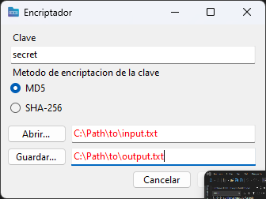
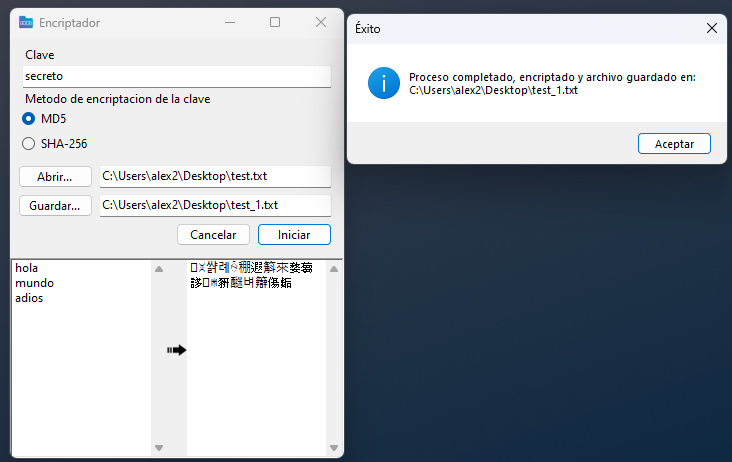
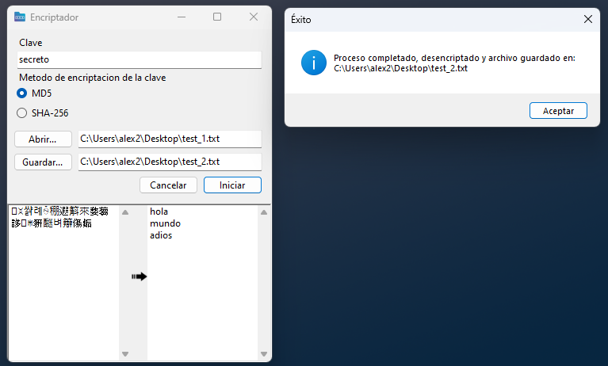

# Encriptador de Texto - Proyecto Métodos

**Versión:** 3.0.0  
**Autor:** Héctor Alejandro Meléndez Torres  
**Requisitos:** Windows 10 o superior (64 bits)

---

## 🧩 Descripción

Este proyecto es una aplicación de escritorio desarrollada en C# (.NET Framework) que permite encriptar y desencriptar textos utilizando algoritmos personalizados implementados en Python. La interfaz gráfica está construida con Windows Forms, y la lógica de encriptación se maneja mediante scripts de Python integrados en la aplicación.

---

## 📂 Contenido del Repositorio

- `ProyectoMetodos.exe` → Ejecutable principal de la aplicación.
- `venv/` → Entorno virtual de Python con las dependencias necesarias.
- `CallPython.cs` → Clase en C# para la interacción con los scripts de Python.
- `Form1.cs` → Código de la interfaz gráfica de usuario.
- `main.py` → Script principal de Python que contiene la lógica de encriptación/desencriptación.
- `functions.py`, `constants.py`, `matrix.py` → Módulos auxiliares de Python para operaciones específicas.
- `ScreenShots/` → Capturas de pantalla de la aplicación en funcionamiento.

---

## ⚙️ Tecnologías Utilizadas

- **Lenguajes:** C# (Windows Forms), Python 3.12.3
- **Interoperabilidad:** Comunicación entre C# y Python mediante la ejecución de procesos.
- **Entorno de Desarrollo:** Visual Studio 2022
- **Sistema Operativo:** Windows 10 o superior (64 bits)

---

## 🚀 Instrucciones de Uso

1. **Clonar el repositorio:**

   ```bash
   git clone https://github.com/HectorAlejandro26/Encriptador.git
   ```

2. **Ejecutar la aplicación:**

   - Navega a la carpeta del proyecto y ejecuta `ProyectoMetodos.exe`.

   - Asegúrate de que el entorno virtual de Python (`venv/`) esté presente en el mismo directorio.

3. **Interacción:**

   - Ingresa el texto que deseas encriptar o desencriptar en el campo correspondiente.

   - Selecciona la operación deseada y presiona el botón correspondiente.

   - El resultado se mostrará en la interfaz, y podrás copiarlo al portapapeles si lo deseas.

---

## 📸 Capturas de Pantalla



*Imagen: Interfaz principal de la aplicación.*



*Imagen: Ejemplo de encriptado.*



*Imagen: Ejemplo de desencriptado.*

---

## 🧠 Contribuciones

Las contribuciones son bienvenidas. Si deseas mejorar la aplicación o agregar nuevas funcionalidades, por favor realiza un fork del repositorio y envía un pull request con tus cambios.

---

## 📬 Contacto

Para preguntas o sugerencias, puedes contactar al autor a través de su perfil de GitHub: [HectorAlejandro26](https://github.com/HectorAlejandro26)
